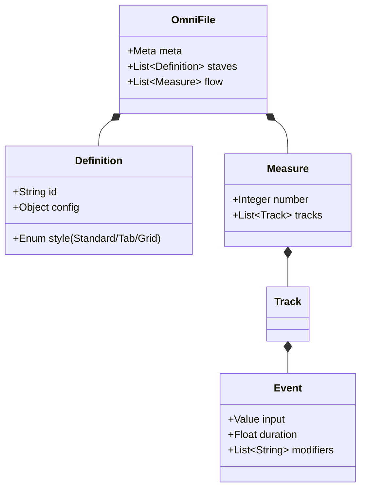
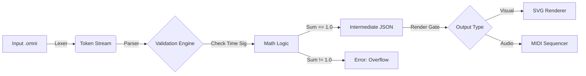
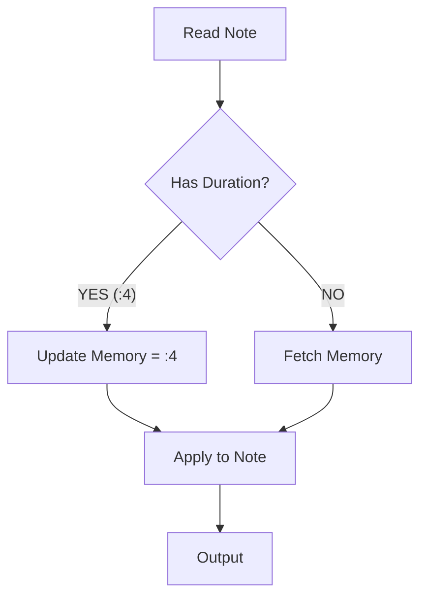

Here is the corrected **OmniScore Master Reference**.

This version strictly separates concerns:
1.  **Mermaid** is used **only** for internal engineering logic (Architecture, Data Flow, Parsing).
2.  **ASCII Art** is used to simulate the **Visual Rendering** of the music, ensuring you can see what the output looks like directly in the documentation.

***

# 🎼 OmniScore: The Master Reference

[](https://github.com/omniscore) [](https://github.com/omniscore) [](https://github.com/omniscore) [](https://github.com/omniscore)

**The Universal Text-to-Music Standard.**

OmniScore is a declarative language that generates high-fidelity music notation from simple text. It treats music as a coordinate system (Time × Vertical State), allowing it to represent everything from orchestral scores to guitar tabs and avant-garde graphic notation in a single, unified syntax.

---

## 🏗 The Engineering Architecture (Logic Layer)

The following diagrams explain how the OmniScore engine structures data internally.

### 1. The Data Hierarchy
How the text file maps to an internal database schema.



### 2. The Parsing Pipeline
How text becomes music.



---

## 🎨 The Visual Output (Presentation Layer)

Since GitHub cannot render the actual SVG output, the following **ASCII Simulations** demonstrate exactly how the code translates to the screen.

### 1. Standard Notation
**Code:**
```javascript
measure 1
  vln: c5:4.stc  e5:4  g5:2 |
```

**Rendered Output:**
```text
      (.)
|------●------------------------|
|--------------●----------------|
|----------------------O--------|
|===============================|
       C5      E5      G5
```

### 2. Guitar Tablature & Strums
**Code:**
```javascript
measure 1
  gtr: 0-6:2  [0-6 2-5 2-4]:2.down |
```

**Rendered Output:**
```text
|----------------------2--------|
|----------------------2--------|
|----------------------0--------|
|-------------------------------|
|-------------------------------|
|------0------------------------|
                   [STRUM ↓]
```

### 3. Percussion Grid
**Code:**
```javascript
measure 1
  kit: k:4  h:8 h  s:4  k:16 k k k |
```

**Rendered Output:**
```text
Hi-Hat |       x  x                 |
Snare  |              O             |
Kick   |   O              o o o o   |
       |---|--|--|--|--|--|--|--|---|
           1     2     3     4
```

---

## 📚 Syntax Reference & Examples

### 1. Basics: Pitch & Rhythm
**Logic:** If specific duration or octave is omitted, the parser infers it from the previous event.

```javascript
omniscore
  def flt "Flute" style=standard

  measure 1
    %% Start at C4. Subsequent notes find closest neighbor.
    %% Duration :4 is applied to d, e, f automatically.
    flt: c4:4 d e f | g a b c5 |
  
  measure 2
    %% Jumping intervals requires explicit octave
    flt: c5:2 g4:2 | c4:1 |
```

### 2. The Guitar Engine (Tablature)
**Logic:** Uses a coordinate system `[Fret]-[String]`. Modifiers handle guitar-specific techniques.

```javascript
omniscore
  def gtr "Lead Gtr" style=tab tuning=[E2,A2,D3,G3,B3,E4]

  measure 1
    %% Bend 12th fret up a full step, then release
    gtr: 12-2:4.bu(full)  12-2:4.bd(0) |
    
    %% Strumming (Stacked Notes)
    gtr: [0-6 2-5 2-4]:2.down |
```

### 3. The Percussion Engine (Grid)
**Logic:** Maps specific characters to vertical positions on a non-pitch staff.

```javascript
omniscore
  %% Define kit: Kick(k) bottom, Snare(s) middle, Hat(h) top
  def kit "Drums" style=grid map={ k:0, s:3, h:5 }

  measure 1
    %% Standard Rock Beat with Ghost Notes (.ghost)
    kit: k:4    h:8 h    s:4.acc    h:8 h.ghost |
```

### 4. Piano & Polyphony
**Logic:** `group` connects staves. `{ v1... v2... }` creates multi-threaded logic within a single measure.

```javascript
omniscore
  group "Piano" symbol=brace {
    def rh "Right" style=standard clef=treble
    def lh "Left"  style=standard clef=bass
  }

  measure 1
    rh: {
      v1: e5:4 f5 g5 e5 | %% Voice 1 (Stems Up)
      v2: c5:2     c5:2 | %% Voice 2 (Stems Down)
    }
    lh: c3:1            |
```

### 5. Vocal & Lyrics
**Logic:** The `link` property binds text to rhythm. Hyphens `-` shift to the next note; underscores `_` hold the word (melisma).

```javascript
omniscore
  def vox "Soprano" style=standard
  def txt "Lyrics"  style=text link=vox

  measure 1
    vox: c5:4   d5:4   e5:2        |
    txt: "Glo"  -      "ria"       |
```

### 6. Orchestral Logic (Transposition)
**Logic:** Score is written in Concert Pitch. `transpose` shifts the *rendering* for the player without changing the data.

```javascript
omniscore
  %% Alto Sax sounds Major 6th lower
  def sax "Alto Sax" style=standard transpose=+9

  measure 1
    %% Written as Concert C. Renders as A on the sheet.
    sax: c4:4 e4 g4 c5 |
```

### 7. Complex Time & Tuplets
**Logic:** `(ratio: events)` overrides binary subdivision.

```javascript
omniscore
  meta { time: 7/8 }
  def vln "Violin" style=standard

  measure 1
    %% Triplet (3 in time of 2) inside 7/8 time
    vln: c5:4 (3:2 d5:8 e5 f5) g5:8. |
```

### 8. Flow Control
**Logic:** Programmatic structure for repeats and jumps.

```javascript
omniscore
  repeat 2x {
    measure 1
      vln: c5:4 e5 g5 c6 |
  } alternative {
    1. { measure 2 { vln: g5:1 } }
    2. { measure 3 { vln: c6:1.fine } }
  }
```

### 9. Experimental & Canvas
**Logic:** Direct vector injection for graphic scores.

```javascript
omniscore
  def noise "Generator" style=canvas range=0..100

  measure 1
    %% Draw a sine wave visually
    noise: draw(wave, freq=5Hz, amp=50%, y=50) |
```

---

## ⚙️ The Engine Internal Logic

How does OmniScore reduce redundancy and validate math?

### 1. Syntax Logic: "Sticky Attributes"
The parser state machine creates efficiency by remembering the last used duration.



### 2. Intermediate Representation (IR)
All syntax is compiled into this JSON structure before rendering. This is the API surface for developers.

```json
{
  "track": "vln",
  "measure": 1,
  "events": [
    {
      "type": "note",
      "pitch": { "step": "C", "octave": 4 },
      "duration": 0.25,
      "modifiers": ["staccato"],
      "timestamp": 0.0
    }
  ]
}
```

---

*Documentation generated by Arthur Penhaligan Engineering, 2025.*
