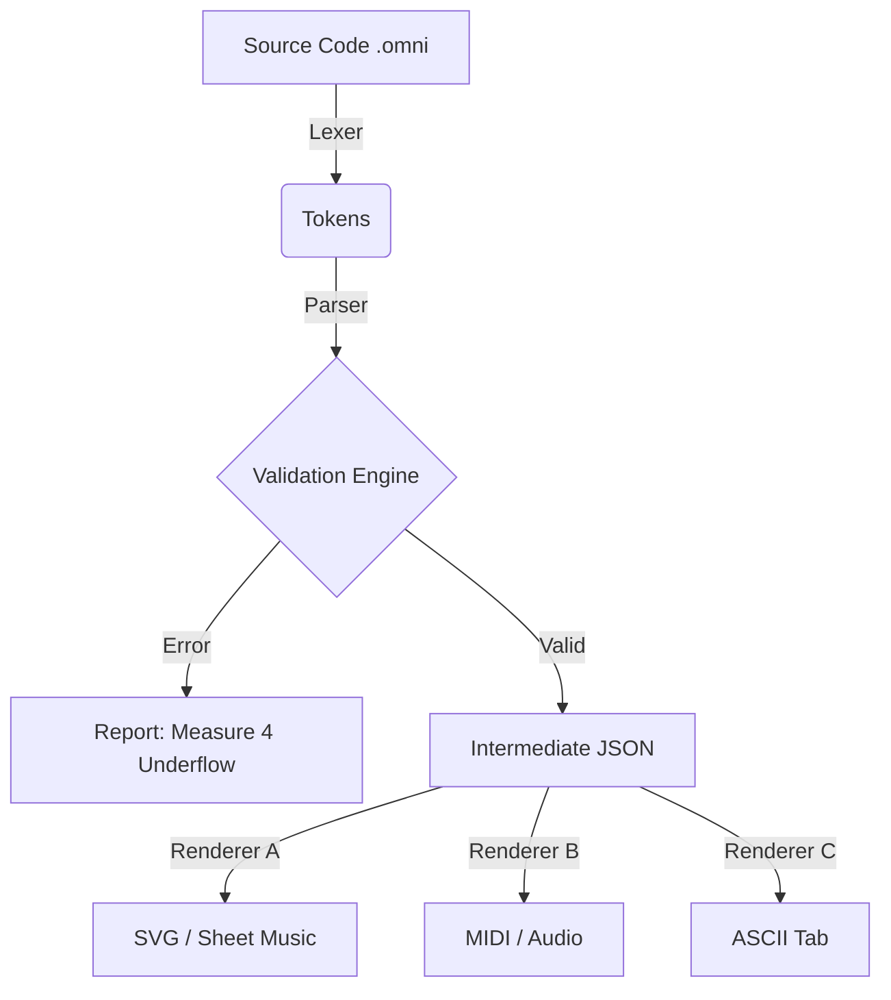

# 🎼 OmniScore: The Master Reference

[](https://github.com/omniscore) [](https://github.com/omniscore)

**The Universal Text-to-Music Standard.**
This document contains comprehensive examples demonstrating the robustness of the OmniScore syntax across all musical disciplines.

---

## 📚 Table of Contents

1.  [Basics: Pitch & Rhythm](#1-basics-pitch--rhythm)
2.  [The Guitar Engine (Tablature)](#2-the-guitar-engine)
3.  [The Percussion Engine (Grid)](#3-the-percussion-engine)
4.  [Piano & Polyphony](#4-piano--polyphony)
5.  [Vocal & Lyrical Syntax](#5-vocal--lyrical-syntax)
6.  [Orchestral Logic](#6-orchestral-logic)
7.  [Complex Time & Tuplets](#7-complex-time--tuplets)
8.  [Flow Control (Repeats/Coda)](#8-flow-control)
9.  [Experimental & Microtonal](#9-experimental--microtonal)
10. [The Rendering Logic](#10-the-rendering-logic)

---

## 1. Basics: Pitch & Rhythm

### Example 1.1: The Scale (Inference Logic)
*Logic Check:* If octave is omitted, OmniScore selects the pitch closest to the previous note (within a 4th).

```javascript
omniscore
  def flt "Flute" style=standard

  measure 1
    %% Start at C4. Subsequent notes find closest neighbor.
    flt: c4:4 d e f | g a b c5 |
  
  measure 2
    %% Jumping intervals requires explicit octave
    flt: c5:2 g4:2 | c4:1 |
```

### Example 1.2: Accidentals & Key Signatures
*Logic Check:* The `key` meta-property sets the rendering display, but input notes can be explicit (`#`, `b`) or obey the key (`n` for natural).

```javascript
omniscore
  meta { key: F#m } %% Key implies F#, C#, G#

  def vln "Violin" style=standard

  measure 1
    %% f = f# (implied by key), gn = g natural (explicit)
    vln: f4:4 gn4 a4 b4 |
    
    %% c#5 (implied), db5 (enharmonic equivalent)
    vln: c5:2 db5:2 |
```

---

## 2. The Guitar Engine

### Example 2.1: Chords & Strumming
*Logic Check:* Stacking inputs (`[]`) creates vertical alignment. `d` and `u` modifiers denote strum direction.

```javascript
omniscore
  def gtr "Rhythm Gtr" style=tab

  measure 1
    %% E Major Chord held for 2 beats, then strummed
    gtr: [0-6 2-5 2-4 1-3 0-2 0-1]:2.down
         [0-6 2-5 2-4]:8.d  [0-6 2-5 2-4]:8.u  r:4 |
```

### Example 2.2: Lead Techniques
*Logic Check:* Complex articulations (Bends, Hammer-ons, Slides).

```javascript
omniscore
  def lead "Lead Gtr" style=tab

  measure 1
    %% Bend 12th fret up a full step, then release
    lead: 12-2:4.bu(full)  12-2:4.bd(0)
    
    %% Hammer-on / Pull-off sequence
    lead: 10-2:8.h(12) 12-2:8.p(10)
    
    %% Slide from 5 to 10
    lead: 5-3:4.slide(10) |
```

### Example 2.3: Alternate Tunings
*Logic Check:* String 6 becomes D2 instead of E2. Logic validates fret range (e.g., negative numbers invalid).

```javascript
omniscore
  %% Drop D Tuning definition
  def gtr "Metal" style=tab tuning=[D2,A2,D3,G3,B3,E4]

  measure 1
    %% Open low string is now D
    gtr: [0-6 0-5 0-4]:8.pm [0-6 0-5 0-4]:8.pm |
```

---

## 3. The Percussion Engine

### Example 3.1: The Drum Map
*Logic Check:* Mapping specific characters to vertical positions (Y-axis) on a non-pitch staff.

```javascript
omniscore
  %% Define the kit: Kick(k) bottom, Snare(s) middle, Hat(h) top
  def kit "Drums" style=grid map={ k:0, s:3, h:5, c:6 }

  measure 1
    %% Standard Rock Beat
    kit: k:4    h:8 h    s:4    h:8 h |
    
    %% Crash on 1, Snare fill at end
    kit: c:4    h:8 h    s:16 s s s |
```

### Example 3.2: Ghost Notes & Accents
*Logic Check:* Dynamics apply to individual hits in the grid.

```javascript
  measure 1
    %% Parentheses around note = ghost note (.ghost)
    kit: s:4.acc   s:8.ghost   s:8.ghost   s:4.acc |
```

---

## 4. Piano & Polyphony

### Example 4.1: The Grand Staff
*Logic Check:* Linking two staves with a brace (`group`).

```javascript
omniscore
  group "Piano" symbol=brace {
    def rh "Right" style=standard clef=treble
    def lh "Left"  style=standard clef=bass
  }

  measure 1
    rh: c5:8 d5 e5 f5  g5:2 |
    lh: c3:1                |
```

### Example 4.2: Multi-Voice (Fugue Logic)
*Logic Check:* `v1` (stems up) and `v2` (stems down) must sum to the same total duration per measure.

```javascript
omniscore
  def pno "Piano" style=standard

  measure 1
    pno: {
      %% Voice 1: Quarter notes (Total 4 beats)
      v1: e5:4  f5:4  g5:4  e5:4 |
      
      %% Voice 2: Half notes (Total 4 beats)
      v2: c5:2        c5:2       |
    }
```

---

## 5. Vocal & Lyrical Syntax

### Example 5.1: Syllabic Alignment
*Logic Check:* Parser counts notes in linked staff and aligns syllables.
*   `-` = Hyphenate (shifts to next note)
*   `_` = Melisma (holds word across notes)

```javascript
omniscore
  def vox "Soprano" style=standard
  def txt "Lyrics"  style=text link=vox

  measure 1
    vox: c5:4   d5:4   e5:2        |
    txt: "Glo"  -      "ria"       |

  measure 2
    vox: f5:4   e5:4   d5:4   c5:4 |
    txt: "in"   "ex"   "cel"  -    |
    
  measure 3
    vox: d5:1                      |
    txt: "sis"                     |
```

---

## 6. Orchestral Logic

### Example 6.1: Transposing Instruments
*Logic Check:* The score is written in *Concert Pitch* (for easy reading/playback), but the `transpose` flag tells the renderer to shift the visual output for the player.

```javascript
omniscore
  %% Alto Sax sounds Major 6th lower (-9 semitones)
  def sax "Alto Sax" style=standard transpose=+9

  measure 1
    %% Written as Concert C. Renders as A on the sheet music.
    sax: c4:4 e4 g4 c5 |
```

---

## 7. Complex Time & Tuplets

### Example 7.1: Odd Time Signatures
*Logic Check:* Measure validation adapts to the numerator.

```javascript
omniscore
  meta { time: 7/8 }

  def vln "Violin" style=standard

  measure 1
    %% 3 + 2 + 2 grouping
    vln: c5:8.acc d5:8 e5:8  f5:4 g5:4 |
```

### Example 7.2: Nested Tuplets
*Logic Check:* `(ratio: events)`. Ratio `5:4` means "play 5 in the time of 4".

```javascript
omniscore
  def flt "Flute" style=standard

  measure 1
    %% Standard Triplet (3 in space of 2 eighths)
    flt: c5:4  (3:2 d5:8 e5 f5)  g5:4 |
    
    %% Quintuplet (5 in space of 1 quarter)
    flt: (5:4 c5:16 d e f g) g5:2. |
```

---

## 8. Flow Control

### Example 8.1: Repeats and Alternatives
*Logic Check:* Programming logic for music structure. `repeat` blocks.

```javascript
omniscore
  def tpt "Trumpet" style=standard

  repeat 2x {
    measure 1
      tpt: c5:4 e5 g5 c6 |
  } alternative {
    %% 1st Ending
    1. { measure 2 { tpt: g5:1 } }
    
    %% 2nd Ending
    2. { measure 3 { tpt: c6:1.fine } }
  }
```

### Example 8.2: D.S. al Coda (Jumps)
*Logic Check:* Using labels and jump instructions.

```javascript
omniscore
  flow
    measure 1..4
      ...
    
    label "Segno"
    measure 5
      ...
    
    instruction "To Coda"
    measure 6
      ...
      
    instruction "D.S. al Coda"
    
    label "Coda"
    measure 7
      ...
```

---

## 9. Experimental & Microtonal

### Example 9.1: Microtones
*Logic Check:* Support for quarter-tone accidentals.

```javascript
omniscore
  def vln "Violin" style=standard

  measure 1
    %% q# = quarter-sharp, qb = quarter-flat
    vln: c4:2  c4.q#:2 | d4.qb:1 |
```

### Example 9.2: Canvas Drawing (Avant-Garde)
*Logic Check:* Direct SVG path injection via the `draw()` function relative to the staff coordinate system.

```javascript
omniscore
  def noise "Generator" style=canvas range=0..100

  measure 1
    %% Draw a sine wave visually
    noise: draw(wave, freq=5Hz, amp=50%, y=50) |
    
    %% Text instruction at beat 3
    noise: text(t=3, "Turn knob clockwise") |
```

---

## 10. The Rendering Logic

How does OmniScore ensure **100% logic consistency**? It parses everything into a standardized JSON structure before rendering.

**Input:**
```javascript
vln: c4:4.stc
```

**Parsed Intermediate Representation (IR):**
```json
{
  "track": "vln",
  "measure": 1,
  "events": [
    {
      "type": "note",
      "pitch": { "step": "C", "octave": 4, "accidental": null },
      "duration": 0.25, // 1/4
      "modifiers": ["staccato"],
      "timestamp": 0.0
    }
  ]
}
```

**Why this matters:**
1.  **Validation:** The parser sums the durations (`0.25 + ...`) to ensure they equal the Time Signature (`1.0` for 4/4). If they don't, it throws a `MeasureOverflowError` or `MeasureUnderflowWarning`.
2.  **Diffing:** You can diff the JSON logic even if the syntax changes.
3.  **Transport:** This JSON can be sent to MIDI players, VexFlow renderers, or Audio Engines.

---

### Visualization of the Engine


