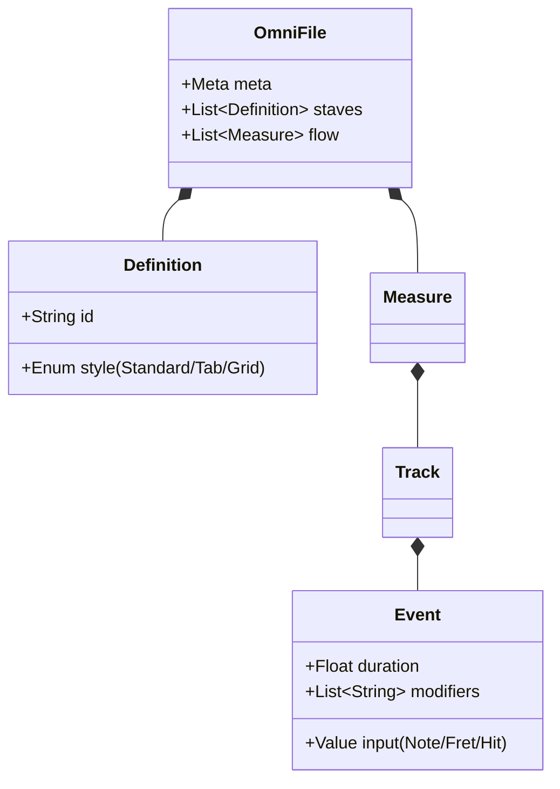

Here is the updated **OmniScore GitHub Page** (`README.md`).

I have integrated the **"AI Vision & Real-World Application"** section, using the *Wicked* score as the case study to demonstrate how OmniScore handles complex multi-instrument logic and optical recognition better than XML.

***

# 🎼 OmniScore

[](https://github.com/omniscore) [](https://github.com/omniscore) [](https://github.com/omniscore) [](https://github.com/omniscore)

**The Universal Text-to-Music Standard.**

OmniScore is a declarative language that generates high-fidelity music notation from simple text. It treats music as a coordinate system (Time × Vertical State), allowing it to represent everything from orchestral scores to guitar tabs and avant-garde graphic notation in a single, unified syntax.

---

## ⚡ At a Glance

### 1. The Code (Input)
You write this in your editor (or generate it via AI):

```javascript
omniscore
  def vln "Violin" style=standard
  def gtr "Guitar" style=tab

  measure 1
    vln: c5:4   e5:4   g5:2   |
    gtr: 0-6:4  2-5:4  3-5:2  |
```

### 2. The Architecture (Logic)
OmniScore treats music as a data grid. Here is how the engine structures the timeline:

```mermaid
gantt
    title OmniScore Timeline Logic (Measure 1)
    dateFormat X
    axisFormat %s
    
    section Violin (Standard)
    C5 (Quarter) : 0, 25
    E5 (Quarter) : 25, 50
    G5 (Half)    : 50, 100
    
    section Guitar (Tab)
    0-6 (Quarter) : 0, 25
    2-5 (Quarter) : 25, 50
    3-5 (Half)    : 50, 100
```



---

## 📸 AI Vision Integration (The "Killer App")

OmniScore is the ideal target format for **Optical Music Recognition (OMR)**. Because it maps logical intent rather than visual pixels, AI Vision models (like GPT-4o or Claude 3.5) can transcribe complex sheet music photos into OmniScore with significantly higher accuracy than MusicXML.

### Case Study: "Music from WICKED"
**The Challenge:** A single page containing Time Signature changes, Instrument Swaps (Timpani → Shaker), and specific Tuning Instructions.

**The OmniScore Solution:**
The AI generates this compact, editable code block from a photo of the score:

```javascript
omniscore
  meta { title: "Music from WICKED", composer: "Stephen Schwartz" }

  %% DEFINITIONS: The player swaps between Timpani and Shaker
  def timp "Timpani" style=standard clef=bass
  def shkr "Shaker"  style=grid     map={x:0} 

  %% LOGIC: Variable Time Signatures
  measure 1
    meta { time: 4/4 } instruction "Tuning: G, D"
    timp: g2:1.roll.ff.accent |

  measure 2..3
    meta { time: 3/4 } timp: r:2. |
    meta { time: 2/4 } timp: d3:2.roll.accent |

  %% LOGIC: Multi-Measure Rests
  measure 9..15
    instruction "With Intensity"
    timp: r:1 | %% Renders as a "7" bar rest

  %% LOGIC: Instrument Change (Measure 121)
  measure 121
    instruction "Shaker"
    %% Engine automatically swaps staff style to 1-line grid
    shkr: x:8.mf x x x x x x x | 
```

| Metric | MusicXML Output | OmniScore Output |
| :--- | :--- | :--- |
| **Tokens** | ~2,000 (Verbose) | ~150 (Efficient) |
| **Logic** | Fragile (Tag soup) | Robust (Human readable) |
| **Editing** | Impossible without GUI | Easy (Edit text) |

---

## 📚 Syntax Reference

### 1. Basics: Pitch & Rhythm
**Logic:** If specific duration or octave is omitted, the parser infers it from the previous event ("Sticky Attributes").

```javascript
omniscore
  def flt "Flute" style=standard

  measure 1
    %% Start at C4. Duration :4 applies to d, e, f automatically.
    flt: c4:4 d e f | g a b c5 |
```

### 2. The Guitar Engine (Tablature)
**Logic:** Uses a coordinate system `[Fret]-[String]`.

```javascript
omniscore
  def gtr "Lead Gtr" style=tab tuning=[E2,A2,D3,G3,B3,E4]

  measure 1
    %% Bend 12th fret up a full step, then release
    gtr: 12-2:4.bu(full)  12-2:4.bd(0) |
    
    %% Strumming (Stacked Notes)
    gtr: [0-6 2-5 2-4]:2.down |
```

### 3. The Percussion Engine (Grid)
**Logic:** Maps specific characters to vertical positions on a non-pitch staff.

```javascript
omniscore
  %% Define kit: Kick(k) bottom, Snare(s) middle
  def kit "Drums" style=grid map={ k:0, s:3, h:5 }

  measure 1
    %% Standard Rock Beat with Ghost Notes (.ghost)
    kit: k:4    h:8 h    s:4.acc    h:8 h.ghost |
```

### 4. Piano & Polyphony
**Logic:** `group` connects staves. `{ v1... v2... }` creates multi-threaded logic within a single measure.

```javascript
omniscore
  group "Piano" symbol=brace {
    def rh "Right" style=standard clef=treble
    def lh "Left"  style=standard clef=bass
  }

  measure 1
    rh: {
      v1: e5:4 f5 g5 e5 | %% Voice 1 (Stems Up)
      v2: c5:2     c5:2 | %% Voice 2 (Stems Down)
    }
    lh: c3:1            |
```

### 5. Orchestral Logic (Transposition)
**Logic:** Score is written in Concert Pitch. `transpose` shifts the *rendering* for the player without changing the data.

```javascript
omniscore
  %% Alto Sax sounds Major 6th lower
  def sax "Alto Sax" style=standard transpose=+9

  measure 1
    %% Written as Concert C. Renders as A on the sheet.
    sax: c4:4 e4 g4 c5 |
```

---

## 🎨 The Visual Output

Since GitHub cannot render SVG securely, here is an **ASCII Simulation** of the rendering engine's output logic.

**Code:**
```javascript
measure 1
  gtr: 0-6:2  [0-6 2-5 2-4]:2.down |
```

**Rendered Output:**
```text
|----------------------2--------|
|----------------------2--------|
|----------------------0--------|
|-------------------------------|
|-------------------------------|
|------0------------------------|
                   [STRUM ↓]
```

---

## ⚙️ The Engine Architecture

The following diagram explains how OmniScore structures data internally, separating the **Source Code** from the **Render Target**.



---

## 🛠 Integration

### For VS Code
Install the extension (coming soon) to get syntax highlighting.

### For Rendering
The renderer converts `.omni` text into SVG, MIDI, or MusicXML.

**CLI Usage:**
```bash
npm install -g omniscore-cli
omniscore render song.omni --out song.svg
omniscore play song.omni --midi output.mid
```

---

*Documentation generated by Arthur Penhaligan Engineering, 2025.*
