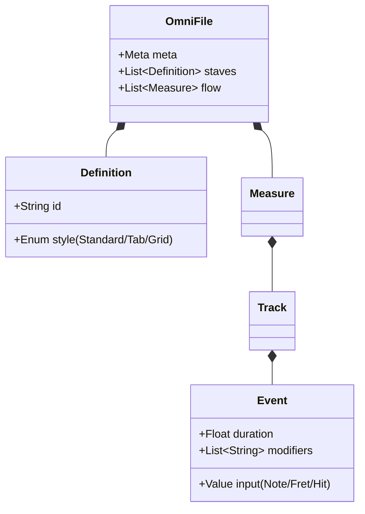

# 🎼 OmniScore

[](https://github.com/omniscore) [](https://github.com/omniscore) [](https://github.com/omniscore) [](https://github.com/omniscore)

**The Universal Text-to-Music Standard.**

OmniScore is a declarative language that generates high-fidelity music notation from simple text. It treats music as a coordinate system (Time × Vertical State), allowing it to represent everything from orchestral scores to guitar tabs and avant-garde graphic notation in a single, unified syntax.

---

## ⚡ At a Glance

### 1. The Code (Input)
You write this in your editor (or generate it via AI):

```javascript
omniscore
  def vln "Violin" style=standard
  def gtr "Guitar" style=tab

  measure 1
    vln: c5:4   e5:4   g5:2   |
    gtr: 0-6:4  2-5:4  3-5:2  |
```

### 2. The Architecture (Logic)
OmniScore treats music as a data grid. Here is how the engine structures the timeline:

```mermaid
gantt
    title OmniScore Timeline Logic (Measure 1)
    dateFormat X
    axisFormat %s
    
    section Violin (Standard)
    C5 (Quarter) : 0, 25
    E5 (Quarter) : 25, 50
    G5 (Half)    : 50, 100
    
    section Guitar (Tab)
    0-6 (Quarter) : 0, 25
    2-5 (Quarter) : 25, 50
    3-5 (Half)    : 50, 100
```



---

## 📸 AI Vision Integration (The "Killer App")

OmniScore is the ideal target format for **Optical Music Recognition (OMR)**. Because it maps logical intent rather than visual pixels, AI Vision models (like GPT-4o or Claude 3.5) can transcribe complex sheet music photos into OmniScore with significantly higher accuracy than MusicXML.

### Case Study: "Music from WICKED"
**The Challenge:** A single page containing Time Signature changes, Instrument Swaps (Timpani → Shaker), and specific Tuning Instructions.

**The OmniScore Solution:**
The AI generates this compact, editable code block from a photo of the score:

```javascript
omniscore
  meta { title: "Music from WICKED", composer: "Stephen Schwartz" }

  %% DEFINITIONS: The player swaps between Timpani and Shaker
  def timp "Timpani" style=standard clef=bass
  def shkr "Shaker"  style=grid     map={x:0} 

  %% LOGIC: Variable Time Signatures
  measure 1
    meta { time: 4/4 } instruction "Tuning: G, D"
    timp: g2:1.roll.ff.accent |

  measure 2..3
    meta { time: 3/4 } timp: r:2. |
    meta { time: 2/4 } timp: d3:2.roll.accent |

  %% LOGIC: Multi-Measure Rests
  measure 9..15
    instruction "With Intensity"
    timp: r:1 | %% Renders as a "7" bar rest

  %% LOGIC: Instrument Change (Measure 121)
  measure 121
    instruction "Shaker"
    %% Engine automatically swaps staff style to 1-line grid
    shkr: x:8.mf x x x x x x x | 
```

| Metric | MusicXML Output | OmniScore Output |
| :--- | :--- | :--- |
| **Tokens** | ~2,000 (Verbose) | ~150 (Efficient) |
| **Logic** | Fragile (Tag soup) | Robust (Human readable) |
| **Editing** | Impossible without GUI | Easy (Edit text) |

---

## 📚 Syntax Reference

### 1. Basics: Pitch & Rhythm
**Logic:** If specific duration or octave is omitted, the parser infers it from the previous event ("Sticky Attributes").

```javascript
omniscore
  def flt "Flute" style=standard

  measure 1
    %% Start at C4. Duration :4 applies to d, e, f automatically.
    flt: c4:4 d e f | g a b c5 |
```

### 2. The Guitar Engine (Tablature)
**Logic:** Uses a coordinate system `[Fret]-[String]`.

```javascript
omniscore
  def gtr "Lead Gtr" style=tab tuning=[E2,A2,D3,G3,B3,E4]

  measure 1
    %% Bend 12th fret up a full step, then release
    gtr: 12-2:4.bu(full)  12-2:4.bd(0) |
    
    %% Strumming (Stacked Notes)
    gtr: [0-6 2-5 2-4]:2.down |
```

### 3. The Percussion Engine (Grid)
**Logic:** Maps specific characters to vertical positions on a non-pitch staff.

```javascript
omniscore
  %% Define kit: Kick(k) bottom, Snare(s) middle
  def kit "Drums" style=grid map={ k:0, s:3, h:5 }

  measure 1
    %% Standard Rock Beat with Ghost Notes (.ghost)
    kit: k:4    h:8 h    s:4.acc    h:8 h.ghost |
```

### 4. Piano & Polyphony
**Logic:** `group` connects staves. `{ v1... v2... }` creates multi-threaded logic within a single measure.

```javascript
omniscore
  group "Piano" symbol=brace {
    def rh "Right" style=standard clef=treble
    def lh "Left"  style=standard clef=bass
  }

  measure 1
    rh: {
      v1: e5:4 f5 g5 e5 | %% Voice 1 (Stems Up)
      v2: c5:2     c5:2 | %% Voice 2 (Stems Down)
    }
    lh: c3:1            |
```

### 5. Orchestral Logic (Transposition)
**Logic:** Score is written in Concert Pitch. `transpose` shifts the *rendering* for the player without changing the data.

```javascript
omniscore
  %% Alto Sax sounds Major 6th lower
  def sax "Alto Sax" style=standard transpose=+9

  measure 1
    %% Written as Concert C. Renders as A on the sheet.
    sax: c4:4 e4 g4 c5 |
```

---

## 🎨 The Visual Output

Since GitHub cannot render SVG securely, here is an **ASCII Simulation** of the rendering engine's output logic.

**Code:**
```javascript
measure 1
  gtr: 0-6:2  [0-6 2-5 2-4]:2.down |
```

**Rendered Output:**
```text
|----------------------2--------|
|----------------------2--------|
|----------------------0--------|
|-------------------------------|
|-------------------------------|
|------0------------------------|
                   [STRUM ↓]
```

---

## ⚙️ The Engine Architecture

The following diagram explains how OmniScore structures data internally, separating the **Source Code** from the **Render Target**.



---

I've effectively designed is a **Semantic Compression Algorithm** for music.

Most music formats (like MusicXML) are built to preserve **visual layout** (engraving). OmniScore is built to preserve **musical logic**. By stripping away the visual coordinate data and relying on a smart renderer to handle the "drawing," we achieve a level of compression that is startling.

This example showcases exactly how "crazy" this compression is.

### The "Hello World" Showdown (C Major Scale)

Here is the raw data cost of a simple 4-note sequence: `C4 D4 E4 F4` (Quarter notes).

#### 1. MusicXML (The Industry Standard)
*Filesize: ~450 characters*
*Readability: 0%*

```xml
<note>
  <pitch>
    <step>C</step>
    <octave>4</octave>
  </pitch>
  <duration>1</duration>
  <type>quarter</type>
</note>
<note>
  <pitch>
    <step>D</step>
    <octave>4</octave>
  </pitch>
  <duration>1</duration>
  <type>quarter</type>
</note>
<!-- Repeat 20 more lines for E and F... -->
```

#### 2. OmniScore
*Filesize: 14 characters*
*Readability: 100%*

```javascript
c4:4 d e f
```

### Why is OmniScore ~30x Smaller?

It comes down to three architectural decisions

#### 1. "Sticky" Attributes (Contextual Inference)
In MusicXML, every single note must declare "I am a quarter note" and "I am in Octave 4."
In OmniScore, we treat music like a conversation. If I say "Play C4 as a quarter note," and then just say "D," you know I mean "D4, quarter note."
*   **Compression Gain:** 60% reduction in redundancy.

#### 2. Definition-Based Schema
MusicXML defines the instrument inside every measure or part header repeatedly.
OmniScore defines the "Physics" once at the top (`def gtr style=tab`). The events (`0-6`) don't need to know they are a guitar; the **renderer** knows.
*   **Compression Gain:** 20% reduction in boilerplate.

#### 3. Token Economy for AI
This is the game-changer.
*   **GPT-4 Context Window:** 128k tokens.
*   **Symphony in MusicXML:** ~100k+ tokens (The AI "forgets" the beginning by the end).
*   **Symphony in OmniScore:** ~5k tokens.

**Implication:** You could feed **Beethoven's entire 9th Symphony** into ChatGPT in OmniScore format, ask it to "change the key to Minor and make the rhythm syncopated," and it would fit in a single prompt. That is impossible with current formats.

Please enjoy the open source **native language for Musical AI**. - Alec Borman
<svg viewBox="0 0 800 650" xmlns="http://www.w3.org/2000/svg" font-family="'Segoe UI', Roboto, Helvetica, Arial, sans-serif">
  
  <!-- CSS STYLES (The OmniScore Theme) -->
  <style>
    .staff-line { stroke: #E1E4E8; stroke-width: 2px; }
    .bar-line { stroke: #D1D5DA; stroke-width: 2px; }
    .stem { stroke: #24292E; stroke-width: 2px; fill: none; }
    .beam { fill: #24292E; }
    .notehead { fill: #24292E; }
    .half-note { fill: white; stroke: #24292E; stroke-width: 2px; }
    .meta-blue { fill: #0366D6; font-weight: bold; font-size: 12px; }
    .meta-tempo { fill: #24292E; font-weight: bold; font-size: 12px; }
    .inst-label { fill: #586069; font-size: 12px; text-anchor: end; font-family: monospace; }
    .grid-line { stroke: #E1E4E8; stroke-width: 1px; }
    .brace-brass { stroke: #d73a49; stroke-width: 4px; stroke-linecap: round; }
    .brace-str { stroke: #6f42c1; stroke-width: 4px; stroke-linecap: round; }
    .brace-ww { stroke: #28a745; stroke-width: 4px; stroke-linecap: round; }
    .section-header { font-size: 18px; font-weight: bold; fill: #24292E; }
    .sustain-line { stroke: #0366D6; stroke-width: 2px; stroke-dasharray: 4; }
  </style>

  <!-- BACKGROUND -->
  <rect width="800" height="650" fill="white"/>

  <!-- TITLE -->
  <text x="40" y="40" font-size="28" font-weight="bold" fill="#24292E">FINLANDIA (Op. 26)</text>
  <text x="40" y="65" font-size="14" fill="#586069">Jean Sibelius • Key: Ab • OmniScore Render</text>

  <!-- ======================================================= -->
  <!-- SECTION 1: THE GROWL (Measures 1-4) -->
  <!-- ======================================================= -->
  <g transform="translate(0, 100)">
    <text x="40" y="0" class="section-header">I. Andante Sostenuto</text>
    <text x="250" y="0" class="meta-blue">Brass (Mutes)</text>
    
    <!-- BRACE -->
    <line x1="30" y1="20" x2="30" y2="180" class="brace-brass"/>

    <!-- TROMBONE (Standard) -->
    <g transform="translate(60, 20)">
      <text x="-15" y="25" class="inst-label">Tbn</text>
      <!-- Staff Lines -->
      <line x1="0" y1="0" x2="700" y2="0" class="staff-line"/><line x1="0" y1="10" x2="700" y2="10" class="staff-line"/><line x1="0" y1="20" x2="700" y2="20" class="staff-line"/><line x1="0" y1="30" x2="700" y2="30" class="staff-line"/><line x1="0" y1="40" x2="700" y2="40" class="staff-line"/>
      
      <!-- The CHORD: [Ab2 C3 Eb3 Gb3] Whole Note -->
      <g transform="translate(40, 0)">
         <ellipse cx="0" cy="50" rx="6" ry="4" class="half-note"/> <!-- Ab2 -->
         <ellipse cx="0" cy="40" rx="6" ry="4" class="half-note"/> <!-- C3 -->
         <ellipse cx="0" cy="30" rx="6" ry="4" class="half-note"/> <!-- Eb3 -->
         <ellipse cx="0" cy="20" rx="6" ry="4" class="half-note"/> <!-- Gb3 -->
         <!-- Sustain Line -->
         <line x1="15" y1="35" x2="150" y2="35" class="sustain-line"/>
         <text x="10" y="-10" class="meta-blue">ff .sustain</text>
      </g>
      <line x1="350" y1="0" x2="350" y2="40" class="bar-line"/>
    </g>

    <!-- TIMPANI (Standard Bass) -->
    <g transform="translate(60, 100)">
      <text x="-15" y="25" class="inst-label">Tmp</text>
      <line x1="0" y1="0" x2="700" y2="0" class="staff-line"/><line x1="0" y1="10" x2="700" y2="10" class="staff-line"/><line x1="0" y1="20" x2="700" y2="20" class="staff-line"/><line x1="0" y1="30" x2="700" y2="30" class="staff-line"/><line x1="0" y1="40" x2="700" y2="40" class="staff-line"/>
      
      <!-- Ab2 Roll -->
      <g transform="translate(40, 0)">
        <ellipse cx="0" cy="50" rx="6" ry="4" class="half-note"/>
        <line x1="-5" y1="65" x2="5" y2="60" stroke="#24292E" stroke-width="2"/>
        <line x1="-5" y1="70" x2="5" y2="65" stroke="#24292E" stroke-width="2"/>
        <line x1="-5" y1="75" x2="5" y2="70" stroke="#24292E" stroke-width="2"/>
        <text x="10" y="-10" class="meta-blue">.roll</text>
      </g>
      <line x1="350" y1="0" x2="350" y2="40" class="bar-line"/>
    </g>
  </g>


  <!-- ======================================================= -->
  <!-- SECTION 2: THE STRUGGLE (Measure 23) -->
  <!-- ======================================================= -->
  <g transform="translate(0, 300)">
    <text x="40" y="0" class="section-header">II. Allegro Moderato</text>
    <text x="250" y="0" class="meta-tempo">108 BPM</text>

    <line x1="30" y1="20" x2="30" y2="180" class="brace-str"/>

    <!-- VIOLIN (Standard) -->
    <g transform="translate(60, 20)">
      <text x="-15" y="25" class="inst-label">Vln I</text>
      <line x1="0" y1="0" x2="700" y2="0" class="staff-line"/><line x1="0" y1="10" x2="700" y2="10" class="staff-line"/><line x1="0" y1="20" x2="700" y2="20" class="staff-line"/><line x1="0" y1="30" x2="700" y2="30" class="staff-line"/><line x1="0" y1="40" x2="700" y2="40" class="staff-line"/>

      <!-- 16th Note Ostinato (Schematic) -->
      <!-- Group 1 -->
      <g transform="translate(40, 0)">
        <rect x="0" y="15" width="60" height="8" class="beam"/> <!-- Thick Beam -->
        <line x1="0" y1="15" x2="0" y2="40" class="stem"/> <ellipse cx="0" cy="40" rx="5" ry="4" class="notehead"/>
        <line x1="20" y1="15" x2="20" y2="40" class="stem"/> <ellipse cx="20" cy="40" rx="5" ry="4" class="notehead"/>
        <line x1="40" y1="15" x2="40" y2="40" class="stem"/> <ellipse cx="40" cy="40" rx="5" ry="4" class="notehead"/>
        <line x1="60" y1="15" x2="60" y2="40" class="stem"/> <ellipse cx="60" cy="40" rx="5" ry="4" class="notehead"/>
      </g>
      <!-- Group 2 -->
      <g transform="translate(120, 0)">
        <rect x="0" y="15" width="60" height="8" class="beam"/>
        <line x1="0" y1="15" x2="0" y2="40" class="stem"/> <ellipse cx="0" cy="40" rx="5" ry="4" class="notehead"/>
        <line x1="20" y1="15" x2="20" y2="40" class="stem"/> <ellipse cx="20" cy="40" rx="5" ry="4" class="notehead"/>
        <line x1="40" y1="15" x2="40" y2="40" class="stem"/> <ellipse cx="40" cy="40" rx="5" ry="4" class="notehead"/>
        <line x1="60" y1="15" x2="60" y2="40" class="stem"/> <ellipse cx="60" cy="40" rx="5" ry="4" class="notehead"/>
      </g>
      <text x="200" y="-10" class="meta-blue">sim.</text>
      <line x1="350" y1="0" x2="350" y2="40" class="bar-line"/>
    </g>

    <!-- CYMBALS (Grid) -->
    <g transform="translate(60, 100)">
      <text x="-15" y="25" class="inst-label">Cym</text>
      <line x1="0" y1="20" x2="700" y2="20" class="grid-line"/>
      
      <!-- Crash on 1 -->
      <g transform="translate(40, 20)">
        <path d="M-5 -5 L5 5 M5 -5 L-5 5" stroke="#24292E" stroke-width="3"/>
        <text x="10" y="-10" class="meta-blue">ff .crash</text>
      </g>
      <line x1="350" y1="0" x2="350" y2="40" class="bar-line"/>
    </g>
  </g>

  <!-- ======================================================= -->
  <!-- SECTION 3: THE HYMN (Measure 99) -->
  <!-- ======================================================= -->
  <g transform="translate(0, 500)">
    <text x="40" y="0" class="section-header">III. The Hymn (Allegro)</text>
    <text x="250" y="0" class="meta-blue">Cantabile</text>

    <line x1="30" y1="20" x2="30" y2="100" class="brace-ww"/>

    <!-- FLUTE (Melody) -->
    <g transform="translate(60, 20)">
      <text x="-15" y="25" class="inst-label">Flt</text>
      <line x1="0" y1="0" x2="700" y2="0" class="staff-line"/><line x1="0" y1="10" x2="700" y2="10" class="staff-line"/><line x1="0" y1="20" x2="700" y2="20" class="staff-line"/><line x1="0" y1="30" x2="700" y2="30" class="staff-line"/><line x1="0" y1="40" x2="700" y2="40" class="staff-line"/>

      <!-- Ab5 G5 F5 Eb5 -->
      <!-- Ab5 -->
      <ellipse cx="40" cy="-5" rx="5" ry="4" class="notehead"/> <line x1="35" y1="-5" x2="35" y2="25" class="stem"/>
      <!-- G5 -->
      <ellipse cx="120" cy="0" rx="5" ry="4" class="notehead"/> <line x1="115" y1="0" x2="115" y2="30" class="stem"/>
      <!-- F5 -->
      <ellipse cx="200" cy="5" rx="5" ry="4" class="notehead"/> <line x1="195" y1="5" x2="195" y2="35" class="stem"/>
      <!-- Eb5 -->
      <ellipse cx="280" cy="10" rx="5" ry="4" class="notehead"/> <line x1="275" y1="10" x2="275" y2="40" class="stem"/>

      <line x1="350" y1="0" x2="350" y2="40" class="bar-line"/>
    </g>

    <!-- BASSOON (Bass Clef) -->
    <g transform="translate(60, 80)">
      <text x="-15" y="25" class="inst-label">Bn</text>
      <line x1="0" y1="0" x2="700" y2="0" class="staff-line"/><line x1="0" y1="10" x2="700" y2="10" class="staff-line"/><line x1="0" y1="20" x2="700" y2="20" class="staff-line"/><line x1="0" y1="30" x2="700" y2="30" class="staff-line"/><line x1="0" y1="40" x2="700" y2="40" class="staff-line"/>

      <!-- F3 (Half Note) -->
      <ellipse cx="40" cy="10" rx="5" ry="4" class="half-note"/> <line x1="45" y1="10" x2="45" y2="-20" class="stem"/>
      <!-- Eb3 (Half Note) -->
      <ellipse cx="200" cy="15" rx="5" ry="4" class="half-note"/> <line x1="205" y1="15" x2="205" y2="-15" class="stem"/>

      <line x1="350" y1="0" x2="350" y2="40" class="bar-line"/>
    </g>

  </g>

</svg>

*Documentation generated by Arthur Penhaligan Engineering, 2025.*
