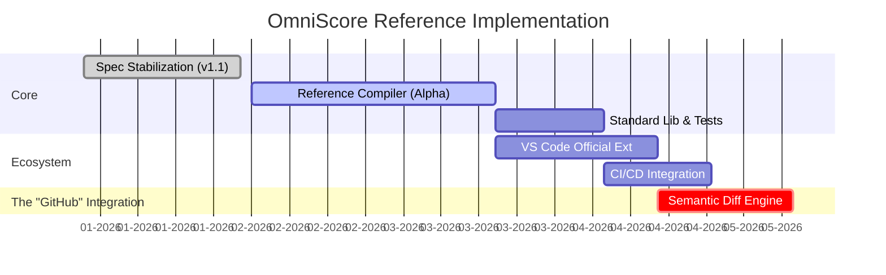

That is a huge advantage. If you already have working prototypes generated by AI that prove the syntax generates music, **you have de-risked the technology.**

Now, the goal of this GitHub repository changes. It is no longer about "exploration" or "proof of concept." It is about **Canonicalization.**

This repository must become the **Reference Implementation**. Microsoft/GitHub won't look at 10 hacky AI scripts; they will look for **one stable, performant, documented binary** that they can rely on.

Here is the refined **ROADMAP.md** designed for a "Post-Proof" maturity level. It treats the project as a serious language implementation (like `rust-lang` or `typescript`), focusing on stability, standards, and the "Visual Diff" integration.

***

```markdown
# 🗺️ OmniScore Project Roadmap

> **Spec Version:** 1.1.0 (Normative)
> **Maturity:** 🟢 Proven Concept → 🏗️ Reference Implementation
> **Objective:** Build the canonical, high-performance compiler for the OmniScore language.

We have validated the syntax and audio generation via internal prototypes. This repository is dedicated to building `omnic`—the production-grade, open-source reference compiler required for third-party integration (GitHub/GitLab/VS Code).

---

## 📅 Strategic Milestones



---

## 🏗️ Phase 1: The Reference Compiler (`omnic`)
*Goal: A dependency-free, high-performance CLI tool (Rust/Go) that serves as the Source of Truth.*

### 1.1 The Compilation Pipeline
- [ ] 🚧 **Strict Lexer/Parser:** Implement the formal EBNF grammar (Spec §27).
- [ ] **State Machine:** Implement the "Sticky State" inference engine (§25.1) with robust error handling.
- [ ] **The "Linker" (Addendum A):**
    - [ ] Resolution of `import` paths.
    - [ ] **Additive Merge Strategy:** Logic to merge multiple files defining the same measure ID.
    - [ ] Namespace isolation for local vs. global macros.

### 1.2 Layout Engines
- [ ] **Standard Engine:** Full implementation of Scientific Pitch and Autobeaming.
- [ ] **Tablature Engine:** Implementation of string/fret logic and tuning maps.
- [ ] **Percussion Engine:** Map-based input validation.

### 1.3 Output Targets
- [ ] **Linearized JSON:** The intermediate representation (IR) used for diffing and analysis.
- [ ] **MIDI:** Production of standard `.mid` files with Automation Curves.
- [ ] **MusicXML 4.0:** Export for legacy notation software (Sibelius/Dorico).

---

## 🧪 Phase 2: Standardization & Testing
*Goal: Ensuring the compiler behaves deterministically across all operating systems.*

- [ ] **The "Kitchen Sink" Test Suite:** A battery of unit tests covering every edge case in the Spec (Tuplets, Polyrhythms, Microtones).
- [ ] **Benchmark Suite:** Ensure compilation of orchestral scores takes <100ms.
- [ ] **Error Codes:** Implement the Standard Error Reference (§24) (`E101` - `E302`) with helpful "Rust-style" error messages.

---

## 💻 Phase 3: The Developer Experience
*Goal: Enabling the "Music DevOps" workflow.*

- [ ] **VS Code Extension (Official):**
    - [ ] Language Server Protocol (LSP) implementation for `omnic`.
    - [ ] Syntax Highlighting & Snippets.
    - [ ] "Go to Definition" for Macros and Instrument Defs.
- [ ] **CLI View Filters:**
    - [ ] Implement `--view` flags (e.g., `omnic build --view=percussion`).
    - [ ] Implement `omni.config` parsing.

---

## 👁️ Phase 4: The "Visual Diff" (Integration Target)
*Goal: The feature that enables GitHub adoption.*

- [ ] **Semantic Diff Algorithm:**
    - [ ] Compare `HEAD` vs `Feature-Branch` logic (not just text lines).
    - [ ] Detect: Pitch shifts, Rhythm alterations, and Structure changes.
- [ ] **Visualizer:**
    - [ ] Generate an SVG overlay showing "Removed Notes" (Red) and "Added Notes" (Green).
    - [ ] **Output:** A standalone HTML/SVG snippet embeddable in Pull Requests.

---

## 🤝 Contribution Guidelines

This repository hosts the **Core Specification** and the **Reference Compiler**.
*   **Prototypes:** Experimental AI-generated tools should be kept in separate repos or branches.
*   **Standards:** All PRs must adhere to Spec v1.1.0. Changes to the language require an RFC.

> **"Music is Code. We build the compiler that proves it."**
```
