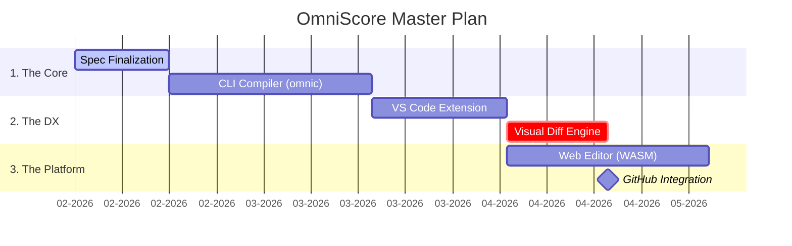

# 🗺️ OmniScore Project Roadmap

> **Current Status:** 🏗️ Phase 1: Core Engine & CLI  
> **Target:** The "Mermaid.js for Music" ecosystem.

This roadmap outlines the path from language specification to native integration with major DevOps platforms (GitHub/GitLab).

---

## 📅 Timeline Overview



---

## 🧩 Legend
*   ✅ **Completed**
*   🚧 **In Progress**
*   ✋ **Help Wanted** (Good First Issue)
*   🔮 **Future Concept**

---

## 🏗️ Phase 1: The Core Engine (`omnic`)
*Goal: A stable Rust/Go compiler that converts `.omni` text into standard outputs.*

### 1.1 Language Specification
- [x] **Draft 1.0:** Complete syntax definition for standard notation.
- [ ] **Tablature Spec:** Finalize syntax for `tuning` and coordinate systems.
- [ ] **Percussion Spec:** Finalize syntax for Map-based input.
- [ ] **Grammar:** Formal EBNF definition for parser generators.

### 1.2 The CLI Compiler
- [ ] 🚧 **Lexer/Parser:** Tokenize the source files.
- [ ] **Context Builder:** Handle "Sticky State" logic (inference engine).
- [ ] **Exporter: MIDI:** Generate `.mid` files for audio playback.
- [ ] **Exporter: SVG:** Generate vector graphics for score rendering.
- [ ] **Exporter: MusicXML:** Interoperability with Sibelius/Finale.
- [ ] ✋ **Error Messaging:** Pretty-print compiler errors (e.g., "Measure 4 overflow").

---

## 💻 Phase 2: Developer Experience (VS Code)
*Goal: The "Trojan Horse." Make the writing experience so good developers prefer it to GUIs.*

- [ ] **Syntax Highlighting:** TextMate grammar for `.omni` files.
- [ ] **Snippets:** Auto-complete for `def`, `measure`, and common patterns.
- [ ] **Live Preview:** Split-pane view rendering SVG in real-time on save.
- [ ] **Audio Playback:** Embedded MIDI player in the IDE.
- [ ] 🔮 **Linter:** Red squiggles for musical errors (e.g., "Voice synchronization mismatch").

---

## 🎨 Phase 3: The "Visual Diff" (The Pitch)
*Goal: The Killer Feature. Prove to GitHub that music can be version controlled.*

- [ ] **Diff Algorithm:** Logic to compare two linearized OmniScore states (not just text lines).
- [ ] **Renderer: Semantic Diff:**
    - [ ] Render deleted notes in **Red**.
    - [ ] Render added notes in **Green**.
    - [ ] Render unchanged context in **Black**.
- [ ] **CLI Command:** `omnic diff --branch main --branch feature/new-part`.

---

## 🌐 Phase 4: The Community Platform
*Goal: A "Mermaid.live" equivalent to build community momentum.*

- [ ] **WASM Compiler:** Port `omnic` to WebAssembly to run client-side.
- [ ] **Web Editor:** Monaco Editor + Live SVG Render.
- [ ] **Sharing:** "Save to GitHub Gist" functionality.
- [ ] **Embed Script:** `<script>` tag to render OmniScore blocks on any website.

---

## 🚀 Phase 5: The "GitHub" Pitch
*Goal: Upstream contribution to `github/markup`.*

- [ ] **Ruby Wrapper:** Create a Gem wrapper for the renderer (required for GitHub architecture).
- [ ] **Sanitization:** Ensure renderer prevents XSS injection via text labels.
- [ ] **The Proposal:** Submit formal RFC to GitHub Engineering.

---

## 🤝 How to Contribute

We follow a "Merge-Request-First" philosophy.
1.  See a `✋ Help Wanted` item above?
2.  Open an Issue to claim it.
3.  Submit a PR linking to the issue.

> "Music is Code. Treat it that way."
```

### How to use this file:

1.  **Save it** as `ROADMAP.md` in the root of your repository.
2.  **Pin it** to your GitHub profile or the repository "Issues" tab.
3.  **Update it manually:** When you finish a task, edit the file and change `[ ]` to `[x]`.
4.  **Link Issues:** As you create actual GitHub issues, link them in the file (e.g., `- [ ] Lexer/Parser (#12)`). This makes the roadmap clickable.
